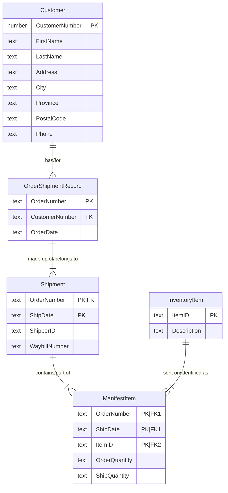

# ESP 5 Solution

## Shipper Details

### 0NF

**Shipper**: ShipperNumber(PK), Name, Address, City, Province, PostalCode, Phone

### 1NF - 3NF

*No Changes*

### Final Entities

**Shipper**: ShipperNumber(PK), Name, Address, City, Province, PostalCode, Phone

----

## Order Shipment

### 0NF

**OrderShipmentRecord**: OrderNumber(PK), FirstName, LastName, CustomerNumber, Address, City, Province, PostalCode, Phone, OrderDate, {{ItemID, Description, OrderQuantity, ShipQuantity}, ShipperID, WaybillNumber, ShipDate}

### 1NF - Isolate Repeating Groups

> When we have nested repeating groups, we should isolate the outer group first and then isolate the nested inner group.

**OrderShipmentRecord**: OrderNumber(PK), FirstName, LastName, CustomerNumber, Address, City, Province, PostalCode, Phone, OrderDate

**Shipment**: OrderNumber(PK|FK), ShipDate(PK), ShipperID, WaybillNumber

**ManifestItem**: OrderNumber(PK|FK1), ShipDate(PK|FK1), ItemID(PK), Description, OrderQuantity, ShipQuantity

> The **ManifestItem** entity has a composite primary key consisting of three attributes. Two of those attributes are working together as a composite foreign key: `OrderNumber, ShipDate`.

### 2NF - Isolate Partial Depedencies

**InventoryItem**: ItemID(PK), Description

**ManifestItem**: OrderNumber(PK|FK1), ShipDate(PK|FK1), ItemID(PK|Fk2), OrderQuantity, ShipQuantity

### 3NF - Isolate Transitive Dependencies

**OrderShipmentRecord**: OrderNumber(PK), CustomerNumber(FK), OrderDate

**Customer**: CustomerNumber(PK), FirstName, LastName, Address, City, Province, PostalCode, Phone

### Final Entities

**OrderShipmentRecord**: OrderNumber(PK), CustomerNumber(FK), OrderDate

**Customer**: CustomerNumber(PK), FirstName, LastName, Address, City, Province, PostalCode, Phone

**InventoryItem**: ItemID(PK), Description

**ManifestItem**: OrderNumber(PK|FK1), ShipDate(PK|FK1), ItemID(PK|Fk2), OrderQuantity, ShipQuantity

**Shipment**: OrderNumber(PK|FK), ShipDate(PK), ShipperID, WaybillNumber

